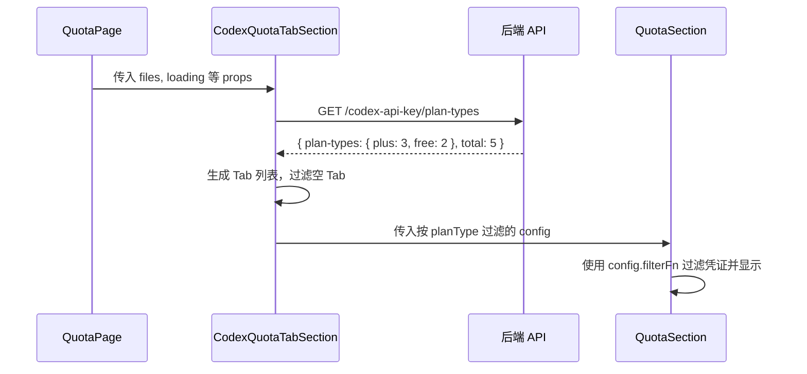

# 设计文档：Codex 套餐分 Tab 显示与额度管理

## 概述

本设计在现有 QuotaPage 的 Codex 区域中引入 Tab 机制，将原来单一的 `<QuotaSection config={CODEX_CONFIG}>` 替换为新的 `<CodexQuotaTabSection>` 组件。该组件内部按套餐类型（Plus/Free/Team/通用）分 Tab 展示凭证，每个 Tab 独立管理额度加载和刷新。同时扩展 `ProviderKeyConfig` 类型和序列化/反序列化逻辑以支持 `planType` 字段，并在 `AiProvidersCodexEditPage` 中增加 PlanType 选择器。

## 架构

### 组件层级

```
QuotaPage
├── QuotaSection (Antigravity)
├── CodexQuotaTabSection (新组件，替换原 CODEX_CONFIG 的 QuotaSection)
│   ├── Tab 栏 (动态生成)
│   └── QuotaSection (复用现有组件，按 planType 过滤)
├── QuotaSection (Gemini CLI)
└── KiroQuotaSection
```

### 数据流



## 组件与接口

### 1. CodexQuotaTabSection 组件

新建 `src/components/quota/CodexQuotaTabSection.tsx`

```typescript
interface CodexQuotaTabSectionProps {
  files: AuthFileItem[];
  loading: boolean;
  disabled: boolean;
  onFileDeleted?: (name: string) => void;
}
```

职责：
- 调用 `GET /codex-api-key/plan-types` 获取套餐类型
- 根据返回的套餐类型动态生成 Tab
- 维护当前选中的 Tab 状态
- 为每个 Tab 创建对应的 `QuotaConfig`（通过修改 `filterFn` 按 planType 过滤）
- 将过滤后的 config 传给现有 `QuotaSection` 组件复用

### 2. Tab 生成逻辑

预定义 Tab 顺序：`['plus', 'team', 'free', 'general']`

对于每个 planType，生成一个 `QuotaConfig`，其 `filterFn` 在原有 `isCodexFile` 基础上增加 planType 匹配：

```typescript
// planType === 'general' 时匹配空值或未知值
const filterByPlanType = (file: AuthFileItem, planType: string) => {
  const filePlanType = resolveCodexPlanType(file) || 'general';
  return planType === 'general'
    ? !['plus', 'free', 'team'].includes(filePlanType)
    : filePlanType === planType;
};
```

### 3. API 层扩展

在 `src/services/api/providers.ts` 中新增：

```typescript
interface CodexPlanTypesResponse {
  'plan-types': Record<string, number>;
  total: number;
}

async getCodexPlanTypes(): Promise<Record<string, number>> {
  const data = await apiClient.get('/codex-api-key/plan-types');
  return (data as CodexPlanTypesResponse)['plan-types'] || {};
}
```

### 4. ProviderKeyConfig 类型扩展

在 `src/types/provider.ts` 的 `ProviderKeyConfig` 接口中新增：

```typescript
export interface ProviderKeyConfig {
  apiKey: string;
  prefix?: string;
  baseUrl?: string;
  proxyUrl?: string;
  headers?: Record<string, string>;
  models?: ModelAlias[];
  excludedModels?: string[];
  planType?: string;  // 新增：套餐类型
}
```

### 5. 序列化/反序列化扩展

**normalizeProviderKeyConfig**（`src/services/api/transformers.ts`）：
```typescript
const planType = record?.['plan-type'] ?? record?.planType;
if (planType) config.planType = String(planType).trim();
```

**serializeProviderKey**（`src/services/api/providers.ts`）：
```typescript
if (config.planType?.trim()) {
  payload['plan-type'] = config.planType.trim();
}
```

### 6. CodexEditPage 表单扩展

在 `AiProvidersCodexEditPage.tsx` 中：
- `ProviderFormState` 新增 `planType: string` 字段
- 表单中增加 PlanType 下拉选择器（Select 组件）
- 选项：通用（空值）、Plus、Free、Team
- 保存时将 planType 包含在 payload 中

## 数据模型

### 套餐类型枚举

```typescript
const CODEX_PLAN_TYPES = ['plus', 'team', 'free', 'general'] as const;
type CodexPlanType = typeof CODEX_PLAN_TYPES[number];
```

### Tab 状态

```typescript
interface CodexTabState {
  activeTab: CodexPlanType;
  planTypeCounts: Record<string, number>;  // 从 API 获取
  availableTabs: CodexPlanType[];          // 有凭证的 Tab 列表
}
```

### planType 过滤映射

| planType 值 | 归属 Tab |
|---|---|
| `'plus'` | Plus |
| `'team'` | Team |
| `'free'` | Free |
| `''` / `undefined` / 未知值 | 通用 |

### API 响应格式

**GET /codex-api-key/plan-types**：
```json
{
  "plan-types": { "plus": 3, "free": 2, "general": 1 },
  "total": 6
}
```

## 正确性属性

*正确性属性是在系统所有有效执行中都应成立的特征或行为——本质上是关于系统应该做什么的形式化陈述。属性作为人类可读规范和机器可验证正确性保证之间的桥梁。*

### Property 1: Tab 列表精确匹配有凭证的套餐类型

*对于任意* Codex 凭证列表和套餐类型集合，生成的 Tab 列表应精确包含且仅包含拥有至少一个凭证的套餐类型，不多不少。

**Validates: Requirements 1.3, 2.3**

### Property 2: 按套餐类型过滤凭证的正确性

*对于任意* Codex 凭证列表和任意目标套餐类型，过滤函数返回的凭证列表中每个凭证的 planType 都应匹配目标套餐类型。当目标为 "general" 时，匹配 planType 为空、undefined 或不在预定义列表中的凭证。

**Validates: Requirements 2.2, 6.1, 6.2, 6.3**

### Property 3: Tab 数量标签与过滤结果一致

*对于任意* Codex 凭证列表，每个 Tab 上显示的凭证数量应等于按该套餐类型过滤后的凭证数量。

**Validates: Requirements 2.4**

### Property 4: planType 序列化 round-trip

*对于任意* 包含 planType 字段的 ProviderKeyConfig 对象，先通过 serializeProviderKey 序列化再通过 normalizeProviderKeyConfig 反序列化后，planType 字段的值应与原始值相等。

**Validates: Requirements 5.2, 5.3**

## 错误处理

| 场景 | 处理方式 |
|---|---|
| `GET /codex-api-key/plan-types` 请求失败 | 回退为单一列表模式，显示所有 Codex 凭证（需求 1.2） |
| 某个 Tab 下额度加载失败 | QuotaCard 显示错误信息，不影响其他 Tab |
| planType 字段值异常（非预定义值） | 归类到"通用"Tab（需求 6.3） |
| 保存凭证时网络错误 | 显示错误通知，保持表单状态不变 |

## 测试策略

### 属性测试

使用 `fast-check` 库进行属性测试，每个属性至少运行 100 次迭代。

- **Property 1**: 生成随机凭证列表（planType 随机取值），验证 Tab 列表精确匹配
- **Property 2**: 生成随机凭证列表和随机目标 planType，验证过滤结果正确性
- **Property 3**: 生成随机凭证列表，验证每个 Tab 的数量标签
- **Property 4**: 生成随机 ProviderKeyConfig，验证 round-trip

每个属性测试需标注注释：
```
// Feature: 060212-codex-plan-tab-quota, Property N: {property_text}
```

### 单元测试

- CodexEditPage 表单：验证 PlanType 选择器存在、回显、保存行为
- API 调用：验证 getCodexPlanTypes 请求格式
- 边界情况：空凭证列表、全部为通用类型、API 错误降级

### 测试框架

- 属性测试：`fast-check` + `vitest`
- 单元测试：`vitest` + `@testing-library/react`
- 每个属性测试配置 `numRuns: 100`
