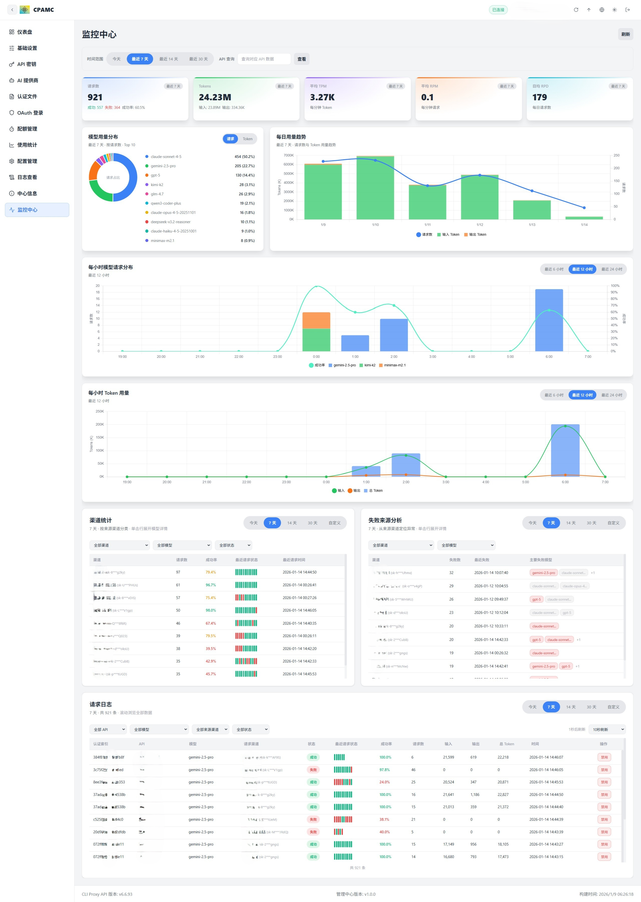

# CLI Proxy API 管理中心 (CPAMC)

> 一个基于官方仓库二次创作的 Web 管理界面

**[English](README_EN.md) | [中文](README.md)**

---

## 关于本项目

本项目是基于官方 [CLI Proxy API WebUI](https://github.com/router-for-me/Cli-Proxy-API-Management-Center) 进行开发的日志监控和数据可视化管理界面

### 与官方版本的区别

本版本与官方版本其他功能保持一致，主要差异在于
+ **新增监控中心**：同步自：https://github.com/kongkongyo/Cli-Proxy-API-Management-Center
+ 增强凭证文件的管理：独立控制proxy_url， 设置antigravity凭证的 User Agent，凭证文件在线编辑
### 界面预览

管理界面展示




为认证文件 单独/批量代理配置：


反重力凭证，批量/单个配置User Agent header


凭证JSON文件编辑


信息脱敏按钮


偏好设置浏览器保存：
原来是修改后，更换页面就失效，现在会存在浏览器中，主要是 分页配置 和 脱敏展示按钮

---

## 快速开始

### 使用本管理界面

在你的 `config.yaml` 中修改以下配置：

```yaml
remote-management:
  panel-github-repository: "https://github.com/escapeWu/CLIProxyAPI-Web-Dashboard"
```

配置完成后，重启 CLI Proxy API 服务，访问 `http://<host>:<api_port>/management.html` 即可查看管理界面

详细配置说明请参考官方文档：https://help.router-for.me/cn/management/webui.html

## 相关链接

- **官方主程序**: https://github.com/router-for-me/CLIProxyAPI
- **官方 WebUI**: https://github.com/router-for-me/Cli-Proxy-API-Management-Center
- **监控中心版本仓库**: https://github.com/kongkongyo/CLIProxyAPI-Web-Dashboard

## 许可证

MIT License
